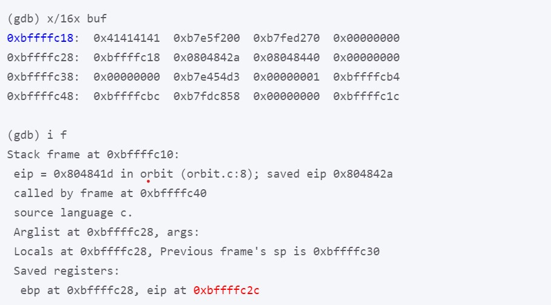
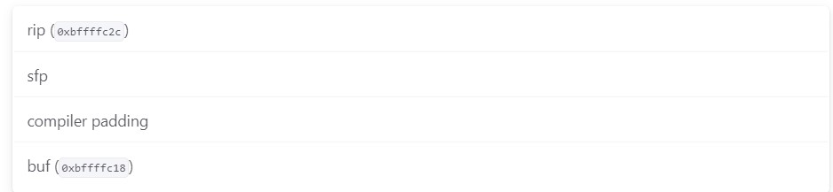
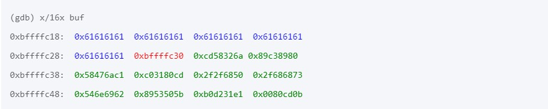

# Question 2: Spica Write-up
## Main Idea
#### (A description of the vulnerability)

The code is vulnerable because ```gets(buf)``` does not check the length of the input from the user, which lets an attacker write past the end of the buffer. We insert shellcode above the saved return address on the stack (rip) and overwrite the rip with the address of shellcode.

## Magic Numbers
#### (How any relevant “magic numbers” were determined, usually with GDB)

We first determined the address of the buffer (0xbffffc18) and the address of the rip of the orbit function (0xbffffc2c). This was done by invoking GDB and setting a breakpoint at line 5.



By doing so, we learned that the location of the return address from this function was 20 bytes away from the start of the buffer (0xbffffc2c - 0xbffffc18 = 20).

## Exploit Structure
#### (A description of your exploit structure)

Here is the stack diagram (You don’t need a stack diagram in your writeup).



The exploit has three parts:

1. Write 20 dummy characters to overwrite buf, the compiler padding, and the sfp.

2. Overwrite the rip with the address of shellcode. Since we are putting shellcode directly after the rip, we overwrite the rip with 0xbffffc30 (0xbffffc2c + 4).

3. Finally, insert the shellcode directly after the rip.

This causes the orbit function to start executing the shellcode at address 0xbffffc30 when it returns.

## Exploit GDB Output
#### (GDB output demonstrating the before/after of the exploit working)

When we ran GDB after inputting the malicious exploit string, we got the following output:



After 20 bytes of garbage (blue), the rip is overwritten with 0xbffffc30 (red), which points to the shellcode directly after the rip (green).

Note: you don’t need to color-code your gdb output in your writeup.
